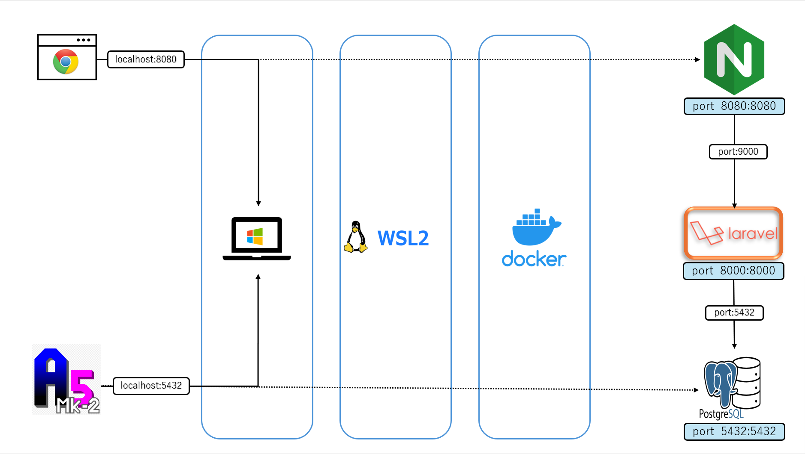

# Application Problem

## 本研修の目的

## curriculum

1. PHP基礎
2. blade基礎
3. controller基礎
4. MVC基礎
5. リクエスト基礎
6. 基礎総合(1)
7. 基礎総合(2)
8. 追加要件

## Environment

- Docker
- nginx
- Laravel
- postgres

### Construction Procedure

1. リモートリポジトリから**startブランチ**のソースをダウンロードする。
   - リモートリポジトリ : <https://github.com/next-ishihara-yuta/application-traning>
2. vsCodeでダウンロードしたフォルダを開く
3. ターミナルを開き、docker-compose.ymlと同じ階層で``docker compose up -d``を実行する
4. ``docker ps``でコンテナが起動していることを確認する
5. ``docker compose exec -it <コンテナ名> bash``を実行しコンテナに入る
6. ``composer create-project --prefer-dist laravel/laravel <任意のプロジェクト名>``を実行しlaravelのプロジェクトを作成する
7. [課題の提出方法](#課題の提出方法)の参考サイトより以下の手順を実行しリモートリポジトリへプッシュする
   1. ローカルリポジトリを作成する
   2. ローカルリポジトリにコミットする
   3. ~~リモートリポジトリを作成する~~ 研修用のリモートリポジトリを使用するため本手順は不要です
   4. ローカルリポジトリとリモートリポジトリを紐づける
   5. リモートリポジトリにプッシュする
      - プッシュする前にブランチ名を``feature/{社員番号}/main``に変更してください 
      - ex : ``feature/nt000/main``

## Submit

- 本課題の提出はgithubを使用してください
  - 参考サイト : <https://www.kagoya.jp/howto/rentalserver/webtrend/vscode/>
- 各課題に取り組む前に``feature/{社員番号}/main``のブランチから``feature/{社員番号}/problem1``などの課題ごとの作業用ブランチを作成してください
- 完了したらgithubのリモートリポジトリのサイトより、作成した作業ブランチから``feature/{社員番号}/main``へのプルリクエストを作成してください。
- メールにて課題の完了報告のメールにて、プルリクエストのリンクの共有とレビューの依頼をしてください
- gitに関して不安な場合は以下のサイトを読んでから研修に取り組むことをお勧めします
  - <https://backlog.com/ja/git-tutorial/>

## Structure

### Technologies and Tools

```
- Nginx : 1.24
- PHP: 8.3
- PostgreSQL: 15.5
- Composer: 2.6
- Xdebug: 3.3
```

### Dir

```
root/
|-- docker
|    |-- nginx
|    |   |-- default.conf
|    |   |-- Dockerfile
|    |-- php-fpm
|    |   |-- ini
|    |   |   |-- xdebug.ini
|    |   |-- Dockerfile
|    |-- postgres
|    |   |-- Dockerfile
|-- docker-compose
|-- Makefile
```

### Container

```
- web
- app
- db
```

- web
  - docker base image： [nginx:1.24.0-bullseye](https://hub.docker.com/layers/library/nginx/1.24.0-bullseye/images/sha256-f618a6de3e2c6464699f7f0cddeb5aff68534932cefad83e9c225b0db4024a03?context=explore)
- app
  - docker base image： [php:8.3.0-fpm-bullseye](https://hub.docker.com/layers/library/php/8.3.0-fpm-bullseye/images/sha256-7f9a0d39b9fa3ce6b07aa5d7bfd06d059236c0a77cc965008afd76d220f95fa3?context=explore)
- db
  - docker base image： [postgres:15.5-bullseye](https://hub.docker.com/layers/library/postgres/15.5-bullseye/images/sha256-b243ba597985f628f09df2726021aa13234afeabf545d7964b2f2ef258c0956a?context=explore)

### configurationDiagram
---


---

#### xdebugの設定

xdebugを使う場合、必要に応じて設定
研修では使用しません。興味を持ったら調べてみてください

参考：

- vscode：[【PHP】VScodeでXdebugを使ってデバッグする](https://zenn.dev/ikeo/articles/244d6a8042bcd8c55fe9#vscode%E3%81%AE%E8%A8%AD%E5%AE%9A)
- IntelliJ：[Docker + Phpstorm で Xdebug を使用する](https://zenn.dev/micronn/articles/5f3cd1d94f99fd)
