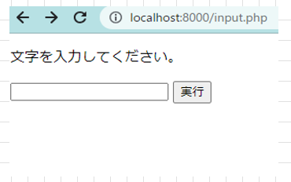
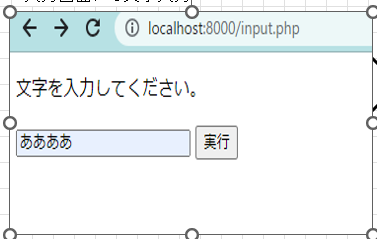
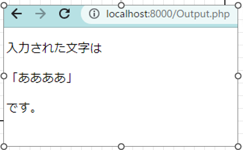

# 教育課題1(PHP基礎)

- 以下の要件を満たすアプリケーションを作成して下さい
- **dockerでPHPのコンテナの立ち上がる環境を構築し、そのコンテナで動くアプリケーションを作成し実行すること**
- **dokcerでPHP+nginx+postgesの3つのコンテナを立ち上げ、PHPのフレームワークでlaravelを使用する環境を構築し、PHPコンテナ上で実行すること**

## 要件

### 入出力アプリケーション

1. 入力画面と出力画面の2画面を作成すること。
2. 入力画面には入力用のテキストボックス1つと、実行ボタンが1つあること。
3. 入力画面にて実行ボタン押下時、出力画面に入力されたテキストの内容が出力されること。
  
## 実装時の制限

### HTML+PHPによるアプリケーション開発

1. 各画面はPHPファイルにHTMLを実装し必要があればPHPの記載を埋め込む。
2. Docker上に起動したPHPコンテナをアプリケーションサーバーとして使用する

## 実行時イメージ

### 入力画面表示

### 入力時画面表示

### 出力時画面表示

