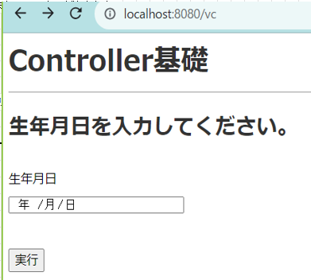
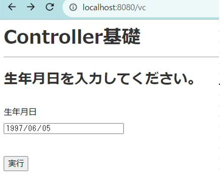
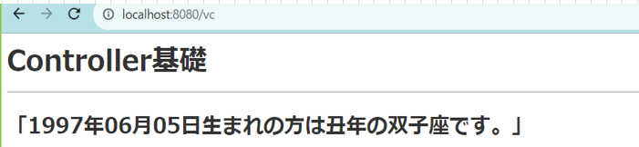

# 教育課題3(controller基礎)

- 以下の要件を満たすアプリケーションを作成して下さい
- **dockerでPHPのコンテナの立ち上がる環境を構築し、そのコンテナで動くアプリケーションを作成し実行すること**

## 要件 

### 入出力アプリケーション

1. 入力画面と出力画面の2画面を作成すること。
2. 入力画面には入力用のテキストボックス1つ(生年月日)と、実行ボタンが1つあること
3. 実行ボタンを押下されたら入力された年の干支と星座を判定し
  
## 実装時の制限

### PHP+Laravel+bladeによるアプリケーション開発

1. 各画面はblade.phpで作成を行う
2. Docker上に起動したPHPコンテナをアプリケーションサーバーとして使用する
3. 判定のロジックはcontrollerに実装する
  
## 実行時イメージ

### 入力画面表示

### 入力時画面表示

### 出力時画面表示

example/problem-1
example/problem-2

