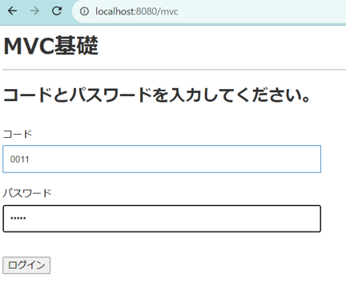
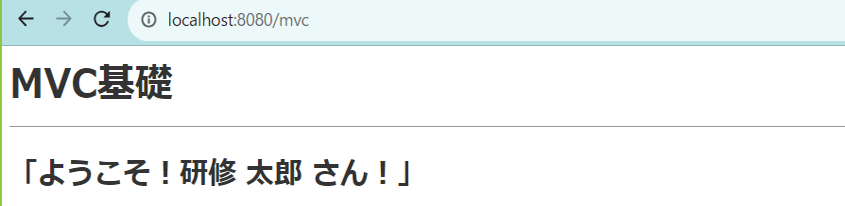
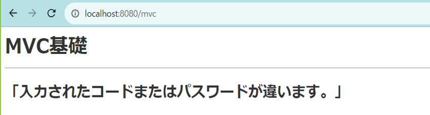

# 教育課題4(MVC基礎)

- 以下の要件を満たすアプリケーションを作成して下さい
- **dockerでPHPのコンテナの立ち上がる環境を構築し、そのコンテナで動くアプリケーションを作成し実行すること**

## 要件 

### 入出力アプリケーション

1. 入力画面と出力画面の2画面を作成すること。	
2. 入力画面には入力用のテキストボックス2つ(ユーザID、パスワード)と、ログインボタンが1つあること。	
3. 入力画面にてログインボタン押下時、テキストボックスに入力されたユーザID、パスワードを基にデータベースを検索し、	
    - 一致する情報があった場合は出力画面に"ようこそ！○○さん！"と表示する。※○○にはユーザ名。
    - 一致する情報が無かった場合は出力画面に"入力されたユーザIDまたはパスワードが違います。"と表示する。
  
## 実装時の制限

### Blade・controller・modelによるMVCモデリングアプリケーション開発

1. 各画面の表示はBlade、ビジネスロジックはController、DB関連の処理はModelで作成を行う。
2. 送信はGET、POSTどちらか適したものを利用する。
3. データの入出力はDB(postgres)を利用する。
4. テーブル作成の際は各カラムで論理名を参考に物理名をつけてください

## データベースサンプル

テーブル情報
|論理名|物理名|
|:----|:----|
|社員||

カラム情報
|論理名|物理名|データ型|Not Null|デフォルト|備考|
|:----|:----|:----|:----|:----|:----|
|id| |serial|Yes| | |
|社員コード| |character(4)| | | |
|パスワード| |character varying(50)| | | |
|社員名| |character varying(56)| | | |
|作成日時| |timestamp(6) without time zone| | | |
|更新日時| |timestamp(6) without time zone| | | |

  
## 実行時イメージ

### 入力画面表示

### 入力時画面表示

### 出力時画面表示

#### 成功時

#### 失敗時

